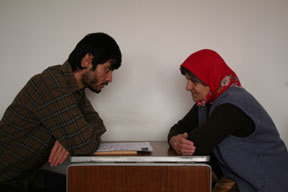
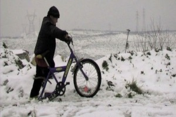
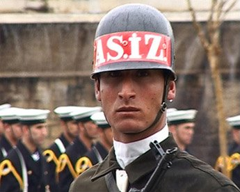
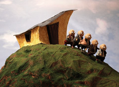

Die [Internationlen Kurzfilmtage
Winterthur](http://www.kurzfilmtage.ch/) zeigten [Kurzfilme aus der
Türkei](http://www.zurichfilmfestival.org/de//filme/3025/kurzes-aus-der-turkei/),
dem diesjährigen Gastland des Zurich Film Festival. Die beiden Festivals
haben schon die letzten Jahre eine Zusammenarbeit gepflegt.

\_\_

[My Mother Learns Cinema](http://www.imdb.com/title/tt0984004/)
---------------------------------------------------------------

(Nesimi Yetik, 2007)

Eine kleine Ode ans Kino, als ersten Schritt um das Kino kennen zu
lernen, lehrt ein Sohn seiner Mutter die korrekte Aussprache einiger
Regisseur.

\_\_

[Biskilet/Bicycle](http://vimeo.com/24874194)
---------------------------------------------

(Serhat Karaaslan, 2010)

Dieser Film, der ganz ohne gesprochene Sprache auskommt, erzählt von
einem Jungen, der gerne ein Fahrrad hätte. Alles was ihm noch fehlt ist
ein Hinterrad…

\_\_

[I, Soldier](http://i-soldier-the-flag.blogspot.com/)
-----------------------------------------------------

(Ergun Köken, 2007)

Ein ganz spezieller Film, der zum Teil aus 2 Perspektiven gefilmt wurde,
wobei beide nebeneinander gezeigt werden. Die Aufnahmen sind während den
Feierlichkeiten zum Unabhängigkeitstag der Türkei entstanden.

\_\_

[Dem (Moment)](https://www.facebook.com/pages/DEM-MOMENT/139449276104220?sk=info)
---------------------------------------------------------------------------------

[")](https://www.facebook.com/pages/DEM-MOMENT/139449276104220?sk=info)
(Aysegül Okul, 2010)

Ein Mann ist auf dem Weg zu einem Bewerbungsgespräch, unterwegs holt er
sich noch einen Kaffee und trifft dabei eine Frau, welche Minuten später
von einem Auto überfahren wird, Kurz darauf durchlebt der Mann die Szene
nochmals, wird er diesmal das Schlimmste verhindern können?

\_\_

[Gemeinschaft](http://www.madebyozlemakin.com/2009/05/gemeinschaft.html)
------------------------------------------------------------------------

(Özlem Akin, 2008)

In diesem kurzen Animationsfilm geht es darum als Gruppe eine unliebsame
Person loszuwerden. Doch wie stellt man das an? Ein witziger
Erklärungsversuch.

\_\_

[Xewna Yusiv / Yusiv’s Dream](http://www.feritkarahan.com/en/#/filmography/movies)
----------------------------------------------------------------------------------

(Ferit Karahan, 2011)

Yusiv führt ein normales Leben bis seine Idylle gestört wird: er wird
heimlicher Zeuge eines Mordes.

\_\_

[KöY (Das Dorf)](http://www.imdb.com/title/tt1515847/)
------------------------------------------------------

[")](http://www.imdb.com/title/tt1515847/)
(Mustafa Dok, 2009)

Der zu Beginn sehr lustig-fröhliche Film zeigt einen Mann, der es sich
zur Aufgabe gemacht hat, auf einem Schild jeweils die genau Anzahl
Personen die sich im Dorf befinden zu notieren. Dieser Spass wird aber
jäh durchbrochen als das Militär auftaucht.

\_\_

[Bende Sira (Ich bin dran)](http://www.distantdreams.de/filme/bende-sira-ich-bin-dran)
--------------------------------------------------------------------------------------

[")](http://www.distantdreams.de/filme/bende-sira-ich-bin-dran)
(Ismet Ergün, 2007)

Zum Abschluss gab es noch ein wahres Highlight: eine Gruppe von Jungs
liebt es ins Kino zu gehen. Da sie nicht genügend Geld haben, gemeinsam
zu gehen, legen sie jeweils zusammen und bestimmen wer gehen darf. Nach
dem Filmbesuch, muss derjenige dann natürlich ganz genau erzählen was
passiert ist. Der Film kommt ganz ohne Untertitel aus, die Bilder
sprechen für sich. Die Jungs können sehr bildgewaltig von ihren
Kinoerlebnissen berichten. Ein Schmaus!

