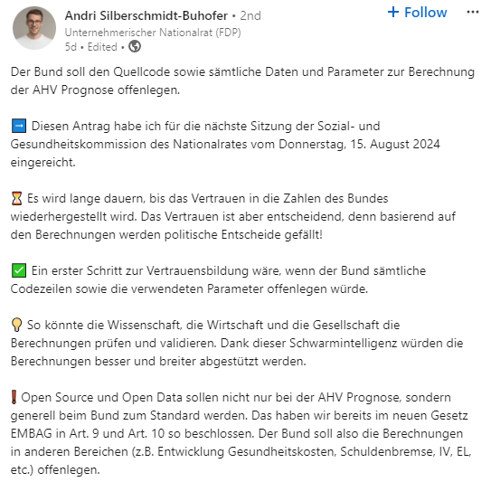

Das Raunen war gross als das Bundesamt für Sozialversicherung (BSV) an einer Medienkonferenz am 6. August 2024 bekannt geben musste, dass es bei der [Berechnung der Prognose der AHV](https://www.srf.ch/news/schweiz/sechs-prozent-weniger-bis-2033-der-bund-hat-sich-bei-den-ahv-ausgaben-verrechnet) einen Fehler gab. Wie konnte das passieren? Und wie kann so etwas in Zukunft verhindert werden?

Zum Beispiel stellte [Andri Silberschmidt die Forderung](https://www.linkedin.com/posts/andrisilberschmidt_nach-rechenpanne-bund-soll-ahv-daten-offenlegen-activity-7227183813431332864-q3n-), den Quellcode (immerhin ca. 70’000 Zeilen Code) zu veröffentlichen. Würde das etwas bringen? Und was hat das [EMBAG Art. 9](https://www.fedlex.admin.ch/eli/fga/2023/787/de#art_9) damit zu tun?

## Open Source als Lösung?

Tatsächlich kann die Veröffentlichung als Open Source zur Vertrauensbildung beitragen. Eine Organisation gibt damit bekannt dass sie a) nichts zu verstecken hat und b) sich dem öffentlich Review stellen will

Und gerade in besonders sensiblen Bereichen kann diese Massnahme dazu beitragen, die Akzeptanz zu steigern. In Bereichen wie den Berechnungsgrundlagen für Prognosen oder statistischen Auswertungen sollte es zum guten Ton gehören, seinen Code zu veröffentlichen. Code, der in der Verwaltung entwickelt wird, sollte auch frei von Geschäftsgeheimnissen sein, sodass sich diese Bereiche besonders gut eignen. Das sieht übrigens auch der Gesetzgeber so und hat deshalb per 1. Januar 2024 das [Bundesgesetz über den Einsatz elektronischer Mittel zur Erfüllung von Behördenaufgaben (EMBAG)](https://www.fedlex.admin.ch/eli/fga/2023/787/de) in Kraft gesetzt. In Art. 9 Abs. 1 heisst es denn auch:

> Die diesem Gesetz unterstehenden Bundesbehörden legen den Quellcode von Software offen, die sie zur Erfüllung ihrer Aufgaben entwickeln oder entwickeln lassen, es sei denn die Rechte Dritter oder sicherheitsrelevante Gründe würden dies ausschliessen oder einschränken.

Das Gesetz umfasst neben der Open Source Thematik auch noch das Thema Open Data und Schnittstellen. Ich habe mich in den letzten Wochen intensiv mit dem EMBAG auseinander gesetzt. Das Resultat davon ist der [EMBAG-Check](https://embag-check.ch/), der Organisationen dabei helfen soll, zu prüfen, ob und wie sie die Anforderungen, die das neue Bundesgesetz stellt, erfüllen können. Es handelt sich um eine Checkliste, die vollgepackt ist mit wichtigen Hinweisen und nützlichen Tipps zu Themen wie [organisatorischen Aspekten](https://embag-check.ch/#Organisatorische%20Aspekte), [Open Government Data](https://embag-check.ch/#Open%20Government%20Data%20\(OGD\)), [Open Source Software](https://embag-check.ch/#Open%20Source%20Software%20\(OSS\)) oder [technischen Schnittstellen](https://embag-check.ch/#Schnittstellen%20/%20APIs).

## Open Source ist keine Wunderwaffe

Wichtig ist aber auch zu betonen, dass kein System durch die reine Veröffentlichung von Code besser wird. Wer soll denn die 70’000 Zeilen Code vom BSV reviewen? Es ist ein Trugschluss, dass dies eine Schar von Freiwilligen dann schon erledigt. Open Source besagt nur, dass ich die _Möglichkeit habe, den Code anzuschauen, wenn ich denn möchte_. Es sagt nichts darüber aus, ob das auch tatsächlich passiert oder ob die gefundenen Fehler behoben werden. Gerade im letzten März konnten wir die [Nachrichten zum gefundenen Backdoor in den XZ Utils](https://de.wikipedia.org/wiki/CVE-2024-3094) lesen, das von einem Angreifer im Open Source Quellcode versteckt wurde. Das Ereignis führte zu [Diskussionen, ob kritische Teile der Infrastruktur von der Arbeit von Freiwilligen abhängen sollten](https://www.theverge.com/2024/4/2/24119342/xz-utils-linux-backdoor-attempt).

Die [BSV hat angekündigt, dass es zwei Forschungsinstitute damit beauftragt hat, unabhängige Modelle zu entwickeln](https://www.bsv.admin.ch/bsv/de/home/publikationen-und-service/medieninformationen/nsb-anzeigeseite.msg-id-102006.html), um die korrigierten Werte zu validieren. Das scheint mir ein guter erster Schritt zu sein. Die Veröffentlichung des Codes sollte aber zwingend auch noch erfolgen, sodass sich alle Interessierten selbst ein Bild machen können. Auch wenn nicht jede Bürgerin und jeder Bürger die Expertise für solche Berechnungen besitzt, so gibt es diese Leute zweifelsohne. Und gerade im Bereich der AHV, wo die Meinungen stark auseinander gehen und jede Seite glaubt „recht“ zu haben, sind verlässliche Zahlen, die sich sogar noch überprüfen lassen, unersetzbar.

Es führt somit kein Weg vorbei, am [Aufbau einer Community](https://www.bk.admin.ch/bk/de/home/digitale-transformation-ikt-lenkung/bundesarchitektur/open_source_software.html) oder beim Aufsetzen eines [Bug-Bounty Programms](https://www.bugbounty.ch/ncsc/). Einen anderen Ansatz hat die Schweizerische Post gewählt: sie hat mit ihrem [E-Voting-Community-Programm](https://evoting-community.post.ch/de) Sicherheitsforschern aus aller Welt ermöglicht den Quellcode ihrer E-Voting Lösung zu analysieren. Der Code ist zwar offen zugänglich, derzeit aber (noch?) nicht unter einer [Open Source Lizenz](https://opensource.org/licenses) veröffentlicht.

Welche weiteren Vorgaben oder Best Practices gibt es sonst noch?

## Ist ihre Organisation EMBAG-ready?

Unter [https://embag-check.ch](https://embag-check.ch/) haben wir eine Checkliste mit obligatorischen Vorgaben und fakultativen Best Practices zusammengestellt. Die Checkliste hilft dabei, Handlungsbedarf zu erkennen und wichtige Fragen zu klären wie:

❔ Ist meine Organisation vom EMBAG betroffen?  
❔ Welche Software muss als Open Source veröffentlicht werden?  
❔ Welche Lizenzen eignen sich für Open Source?  
❔ Welche digitalen Standards müssen genutzt werden?  

❔ Was bedeutet Open-by-Default?
