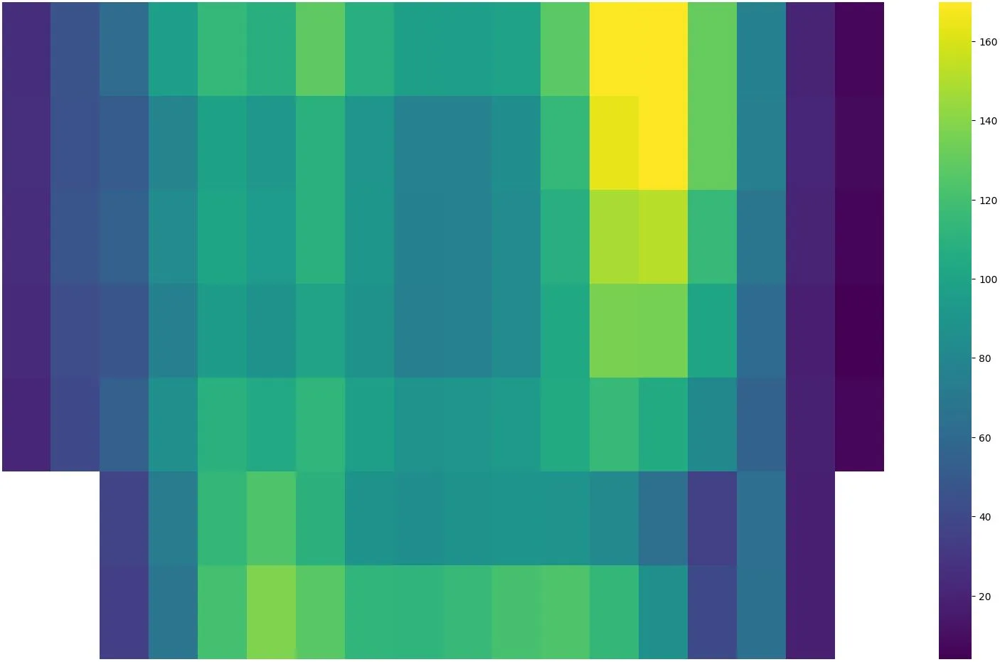
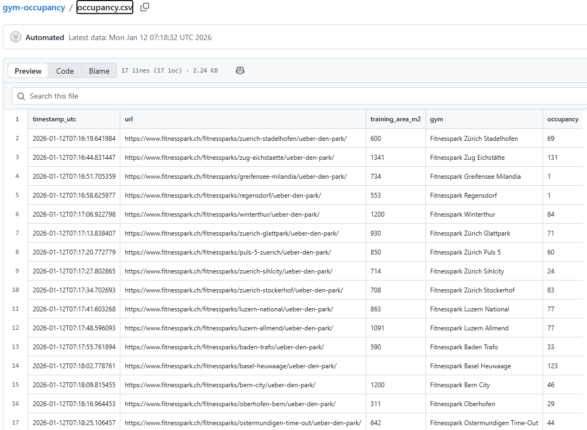
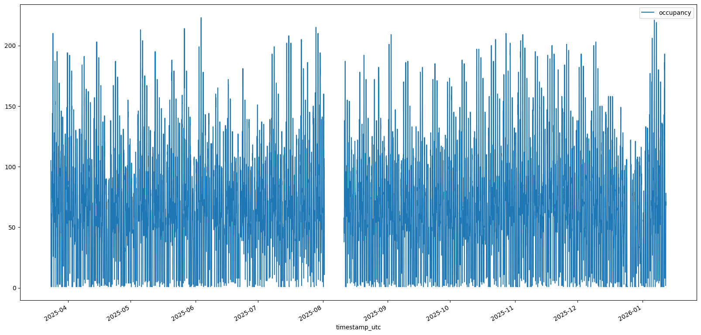
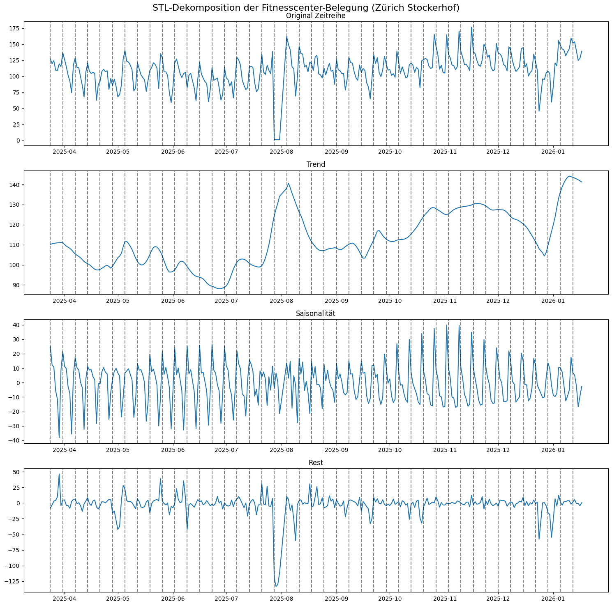
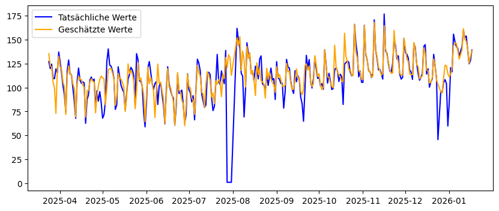
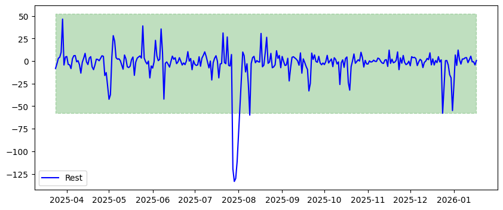
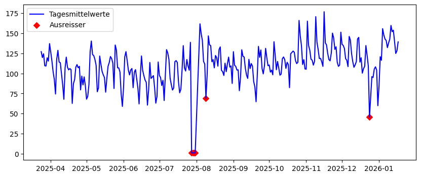

[Dieser Blogpost ist zuerst auf digital.ebp.ch](https://digital.ebp.ch/2026/01/19/von-neujahrsvorsaetzen-bis-abend-peak-was-10-monate-fitnessdaten-verraten/) erschienen.


**Wann ist das Fitnessstudio am leersten? Statt auf Bauchgefühl zu setzen, habe ich Daten gesammelt und dabei spannende Muster entdeckt: von Neujahrsvorsätzen bis Abend-Peak. Ein Blick hinter die Kulissen von 10 Monaten Fitnessdaten.**

Als ich letztes Jahr mit Fitness begann, fragte ich mich: Wann ist das Gym am leersten?
Statt auf mein Bauchgefühl zu vertrauen, habe ich als Data Engineer Daten gesammelt und beim Auswerten spannende Muster entdeckt.

## Git Scraping

Ein schneller Blick auf die Webseite des Fitnesscenters zeigte, dass dort immer die aktuellen Belegungszahlen publiziert werden. Ich vermute, dass diese Zahl direkt vom Einlass-System stammen, da jeder Gym-Besucher und jede Gym-Besucherin sich beim Drehkreuz am Eingang mit einem Badge anmelden und zum Hinausgehen wieder abmelden muss.


_Screenshot Fitnesspark-Webseite mit der Anzahl Besucherinnen und Besucher_

Damit war die Basis für ein Scraping, also das automatisierte Auslesen, der Daten gelegt.
Ich nutze Python und den Ansatz _Git Scraping_ (vgl. den [Blogpost von Simon Willison](https://simonwillison.net/2020/Oct/9/git-scraping/)).
Dabei handelt es sich um eine Methode, bei der Daten regelmässig aus einer Webseite ausgelesen und in einem Git-Repository (in der Git-History) gespeichert werden.
So entsteht automatisch eine Zeitreihe, die sich anschliessend leicht analysieren lässt.


_occupancy.csv zeigt die gesammelten Belegungsdaten_

Ich selbst besuche den [Fitnesspark Zürich Stadelhofen](https://www.fitnesspark.ch/fitnessparks/zuerich-stadelhofen/ueber-den-park/).
Es gibt aktuell 16 Fitnessparks in der Schweiz.
Wenn ich die Daten von _einem_ Fitnesscenter sammeln kann, kann ich das natürlich auch gleich für alle machen…

Mit einem weiteren [Python-Skript](https://github.com/metaodi/gym-occupancy/blob/main/extract_git_history.py) kann ich die ganze Zeitreihe auslesen und dann für eine kleine Datenanalyse verwenden.

## Explorative Datenanalyse

Jetzt da wir eine Zeitreihe haben, ist es Zeit, diese etwas genauer unter die Lupe zu nehmen. Dazu müssen wir uns zuerst einen Überblick verschaffen und verstehen, welche Daten uns vorliegen.

```python
df = pd.read_csv("occupancy_history.csv", parse_dates=[0])
df_stadi = df[df.gym == "Fitnesspark Zürich Stadelhofen"]

fig, ax = plt.subplots(figsize=(20,10))
df_stadi.plot(kind='line', y='occupancy', x="timestamp_utc")
```


_Erster Plot der rohen Daten aus dem Scraping vom Fitnesspark Zürich Stadelhofen_

Schon der erste Plot zeigt: Im August klafft eine Lücke, die Zahlen sinken zum Jahresende und steigen im Januar sprunghaft an. Ein klarer Hinweis auf Neujahrsvorsätze.

## Datenbereinigung

Um die Daten weiter zu analysieren, lohnt es sich, ein paar Bereinigungen durchzuführen.
Dies ermöglicht es dann in einem nächsten Schritt bessere Auswertungen zu machen.
Dieser Schritt ist essenziell um die Datenqualität zu steigern.
Ich setze folgende Verbesserungen um:

*   Zeitangaben auf Lokalzeit in der Schweiz (CET/CEST) umstellen
*   Wir haben aus dem Scraping in den Rohdaten bis zu drei Werte pro Stunde. Für eine gute Vergleichbarkeit ist es empfehlenswert, die Zeitreihe auf Stundenmittelwerte zu sampeln.
*   Die Fitnesscenter haben unterschiedliche Öffnungszeiten. Es lohnt sich daher, die Daten ausserhalb der Öffnungszeiten zu entfernen.

```python
# Zeitzone und Zeit-Features
df["timestamp_utc"] = df.timestamp_utc.dt.tz_localize("UTC")
df["timestamp_cet"] = df.timestamp_utc.dt.tz_convert("Europe/Zurich")
df['hour'] = df['timestamp_cet'].dt.hour
df['dow'] = df['timestamp_cet'].dt.dayofweek  # 0=Mo, 1=Di, ...
df['weekday'] = df['timestamp_cet'].dt.day_name("de_CH")  # Montag, Dienstag, ...

# Werte ausserhalb der Öffnungszeiten entfernen
df = df[(df.hour >= df.start_hour) & (df.hour <= df.end_hour)]

# Re-Sampling auf Stundenmittelwerte
hourly = (df.set_index('timestamp_cet')
            .groupby('gym')
            .resample('1H')
['occupancy'].mean()
            .dropna()
            .reset_index())

```


## Heatmap – oder: Wann sind die meisten Personen im Fitnesscenter?

Nach dieser Vorbereitung sind wir nun bereit für eine erste vertiefte Analyse.
Uns interessiert ja, wann besonders viele oder wenige Personen im Fitnesscenter sind.
Dazu eignet sich unter anderem eine Heatmap, bei der auf der einen Achse die Wochentage und auf der anderen Achse die Uhrzeiten sind.
Schauen wir uns das zuerst über alle Standorte hinweg an:

```python
# Mittelwert pro Wochentag und Stunde
agg = df.groupby(['weekday', 'hour'])
['occupancy'].mean().reset_index()

# Wochentage in richtiger Reihenfolge
order = ['Montag','Dienstag','Mittwoch','Donnerstag','Freitag','Samstag','Sonntag']
pivot_agg = agg.pivot(index='weekday', columns='hour', values='occupancy').reindex(order)

# Heatmap Wochentag × Stunde
plt.figure(figsize=(12,6))
sns.heatmap(pivot_agg, cmap='viridis', annot=False)
plt.title('Aggregierte Belegung: Wochentag × Stunde')
plt.xlabel('Stunde')
plt.ylabel('Wochentag')
plt.show()
```

{group="heatmap1"}

{group="heatmap1"}

{group="heatmap1"}

Die Heatmap bestätigt das Bauchgefühl: Montag bis Mittwoch von 18 bis 20 Uhr sind über alle Fitnesscenter hinweg die Hotspots.
Überraschend: Kein Mittagspeak – und sonntags ist mehr los als samstags.

Spannend ist der Vergleich von verschiedenen Fitnesscentern, da sich die Nutzungsmuster zum Teil stark unterscheiden.
Die Skalen der einzelnen Visualisierungen oben sind jedoch nicht identisch – was den Vergleich stark erschwert.
Ein grosses Studio wirkt in den Visualisierungen voller, obwohl es mehr Platz bietet als ein kleineres.
Deshalb berechne ich im nächsten Schritt aus den absoluten Zahlen die Belegung in Form von «Personen pro 100m²». Damit werden die Visualisierungen vergleichbar.

```python
# Berechne die "Dichte" pro 100 m²
df['density_100m2'] = df['occupancy'] / (df['training_area_m2'] / 100)

heat_all = df.groupby(['weekday','hour'])
['density_100m2'].mean().reset_index()
pivot_all = heat_all.pivot(index='weekday', columns='hour', values='density_100m2').reindex(order)

plt.figure(figsize=(10,5))
sns.heatmap(pivot_all, cmap='viridis', annot=False)
plt.title(f'Belegungsdichte (Personen pro 100 m²)')
plt.xlabel('Stunde')
plt.ylabel('Wochentag')
plt.show()
```


Und wenn wir jetzt diese Skala bei allen Fitnesscentern anwenden, dann kann man die relativ «vollen» deutlich von den relativ «leeren» Fitnesscentern unterscheiden:

## Trend, Saisonalität und Ausreisser

Nachdem wir uns nun intensiv mit der Belegung in der Woche befasst haben, wollen wir zum Abschluss noch etwas zum Trend und Saisonalität der Zeitreihe herausfinden.
Ich habe Daten bisher während circa 10 Monaten, noch nicht ein ganzes Jahr gesammelt (März 2025 bis Januar 2026). Das heisst: Diese Auswertung ist noch etwas mit Vorsicht zu geniessen.

Für diese Analyse verwenden wir die [«Sesonal-Trend decomposition using LOESS (STL)»-Methode aus dem statsmodels](https://www.statsmodels.org/dev/examples/notebooks/generated/stl_decomposition.html) Python-Paket.
Mit STL zerlege ich die Zeitreihe in Trend, Saisonalität und Rest.

*   **Trend**: Der Trend zeigt die langfristige Entwicklung der Zeitreihe. Nimmt die Nutzung eher zu oder ab oder bleiben die Werte mehr oder weniger stabil?
*   **Saisonalität**: Gibt es regelmässige, wiederkehrende Muster (zum Beispiel Sommer vs. Winter)
*   **Rest**: Im Rest finden sich mögliche Ausreisser bzw. diejenigen Anteile der Variabilität in den Daten, die sich nicht mit Trend und Saisonalität erklären lassen. Hier können zum Beispiel Anomalien erkannt werden.

Schauen wir uns diese drei Komponenten für den Fitnesspark Zürich Stockerhof an:

```
from statsmodels.tsa.seasonal import STL

# Aggregation auf Tagesmittelwerte (für klare Saisonalität)
df_stockerhof = df[df.gym == "Fitnesspark Zürich Stockerhof"].dropna().reset_index()
daily = df_stockerhof.groupby('date')
['occupancy'].mean()
daily.index = pd.to_datetime(daily.index)

# STL-Dekomposition
# period=7 für Wochenmuster (7 Tage)
stl = STL(daily, period=7, robust=True)
result = stl.fit()

# Zugriff auf Komponenten
trend, seasonal, resid = result.trend, result.seasonal, result.resid
```



_STL-Dekomposition der Zeitreihe mit Wocheneinteilung_

Wir können sehen, dass der Trend von Mai bis Juli klar abnimmt, dann gibt es einen starken Peak im Sommer (aber Achtung: die Y-Achse beginnt nicht bei 0), der dann erst wieder etwas abflacht, und im Herbst nochmals zunimmt. Im Dezember gehen die Zahlen zurück und im Januar lassen sich die umgesetzten Neujahrsvorsätze anhand dem steilen Anstieg gut ablesen. Bei der Saisonalität ist ein klarer Wochengang erkennbar mit Spitzen am Montag und Senken gegen Ende der Woche.

Die Rest-Komponente eröffnet uns die Möglichkeit, Anomalien oder Ausreisser zu erkennen. Wenn wir die Saisonalität und den Trend zusammennehmen, bildet dies die geschätzten Werte unserer Zeitreihe _ohne_ Ausreisser ab. Wenn wir diese Kurve mit jener der tatsächlichen Zeitreihe vergleichen, können wir visuell die (grossen) Unterschiede sehr klar erkennen.



_Vergleich zwischen geschätzten (Trend + Saisonalität, ohne Anomalien; in orange) und tatsächlichen Werten (in blau)_

Um Ausreisser (in normalverteilten Daten) zu erkennen, wird in der Statistik häufig auch auf die Standardabweichung (_standard deviation_, abgekürzt _stddev_ oder _std_) abgestützt.
Diese beschreibt für eine Verteilung, wie stark die einzelnen Werte um den Durchschnittswert (_mean_) streuen.
Als Ausreisser angeschaut werden dann häufig Werte, die mehr als 3 Standardabweichungen vom Durchschnittswert entfernt liegen.
Ermitteln wir diese Werte mit visueller Unterstützung:

```python
resid_mean = resid.mean()
resid_dev = resid.std()
lower = resid_mean - 3*resid_dev
upper = resid_mean + 3*resid_dev

plt.plot(resid, label='Rest', color='blue')
plt.fill_between([daily.index.min(), daily.index.max()], lower, upper, color="g", alpha=0.25, linestyle="dashed")
```



_Die «Rest»-Komponente (blau) mit der dreifachen (±) Standardabweichung (grün)_ _um den Mittelwert_

Überall dort, wo die blaue Linie den grünen Bereich verlässt, haben wir mit dieser Operationalisierung einen Ausreisser.
Wir sehen deutliche Ausreisser Ende Juli, dann noch einen Anfang August und Ende Dezember.
Was mögen die Gründe für diese Anomalien sein?
Schauen wir uns die Ausreiser in der Zeitreihe genauer an:

```python
anomalies = daily[(resid < lower) | (resid > upper)]
plt.plot(daily, label='Tagesmittelwerte', color='blue')
plt.scatter(anomalies.index, anomalies.values, color="r", marker="D", label="Ausreisser")
```


_Tagesmittelwerte der Zeitreihe mit den markierten Ausreissern_

Die Ausreisser sind vom 28. bis 31. Juli und am 9. August.
Der erste lässt sich sehr einfach erklären: Der Fitnesspark Stockerhof war vom 28. Juli bis 3. August 2025 wegen Revision geschlossen.
Und der (kleinere) Ausreisser am 9. August steht vielleicht auch in diesem Zusammenhang: Wegen der Revision könnten aussergewöhnlich viele Personen ihr Training in der Woche vom 4. bis 8. August nachgeholt haben; im Vergleich fällt dann der Samstag 9. August etwas ab.
Der letzte Ausreisser ist am Heiligabend (24. Dezember), wo offensichtlich weniger Personen im Fitnesscenter sind als sonst.

[Sämtlicher Code und die Daten sind auf GitHub](https://github.com/metaodi/gym-occupancy) frei verfügbar.
Sobald die Zeitreihen etwas länger werden, könnten wir mit Machine Learning auch gut ein Prognose-Modell bauen, um die Belegung vorherzusagen.
